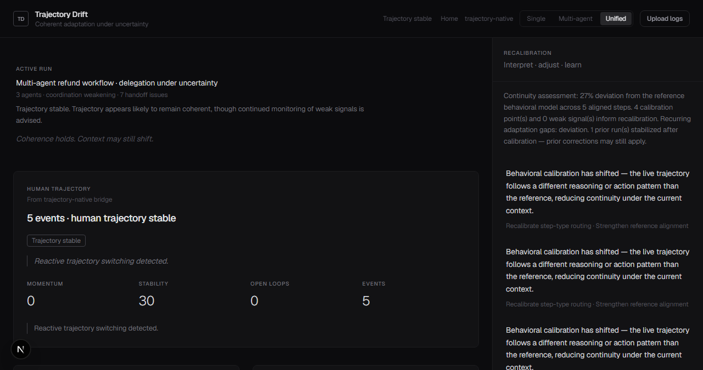

# Trajectory Drift

**Anti-drift infrastructure.**  
Most people — and most teams — don't collapse. They **drift quietly**. Notice early. Steer back.

> Not observability. Not productivity. Navigation.

**trajectory-drift** — drift at scale (teams, agents, orgs).  
**[trajectory-native](https://github.com/higuseonhye/trajectory-native)** — personal steering (tiny turns, reality-contact).

Thesis: [STRATEGY.md](docs/STRATEGY.md) · [steering (native)](https://github.com/higuseonhye/trajectory-native/blob/main/docs/steering.md) · [framework/](framework/)

<p align="center">
  
</p>

---

## Why observability is insufficient

Observability explains what failed **after** collapse.

Drift happens quietly first — unconscious inertia and signal loss, often while metrics still look fine. Trajectory infrastructure catches the fade **before** you wake up in a life you never chose.

---

## What this is

| Not this | This |
|----------|------|
| AI observability SaaS | Quiet drift detection |
| Productivity / habit tracker | Anti-drift + steering |
| Corporate dashboard | Trajectory-aware navigation |

## Capabilities

- **Quiet drift** — inertia, signal loss, fake aliveness, dead-system adaptation ([framework/drift-taxonomy/](framework/drift-taxonomy/))
- **Human trajectory** — momentum, interaction starvation (native bridge)
- **Coordination** — multi-lane graph, handoffs, propagation diffs
- **Human–AI coherence** — overrides, async fatigue, authority conflicts
- **Institutional memory** — policies, incidents, persisted patterns
- **Recovery** — trajectory restoration mechanisms

Expanded: [framework/drift-taxonomy/](framework/drift-taxonomy/) · [organizational drift](framework/organizational-drift/) · [coordination taxonomy](docs/drift-taxonomy.md)

---

## Intended integration environments

- LangGraph workflows · MCP-connected systems
- OpenAI agent orchestration · Claude tool pipelines
- Retrieval-heavy workflows · human-in-the-loop coordination
- Organizational memory systems

---

## Live workspace

```bash
npm install && npm run dev
# → http://localhost:3001/dashboard
```

Toggle **Single** / **Multi-agent** / **Unified** (human + system) demos.

---

## Screenshots

<p align="center">
  
</p>

<p align="center">
  
  
</p>

<p align="center">
  
  
</p>

---

## Architecture

```
core/drift/           alignment & drift detection
core/calibration/     interpret · recovery · journal
core/coordination/    delegation · propagation diffs
core/human-ai/        collaboration coherence
core/org-memory/      institutional patterns
app/                  calm trajectory environment
```

**Docs:** [STRATEGY.md](docs/STRATEGY.md) · [framework/](framework/) · [trajectory-infrastructure.md](docs/trajectory-infrastructure.md) · [bridge.md](docs/bridge.md)

---

## License

MIT
