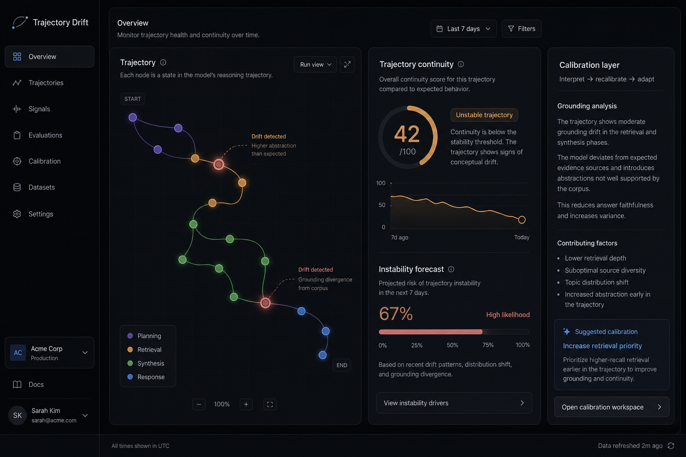
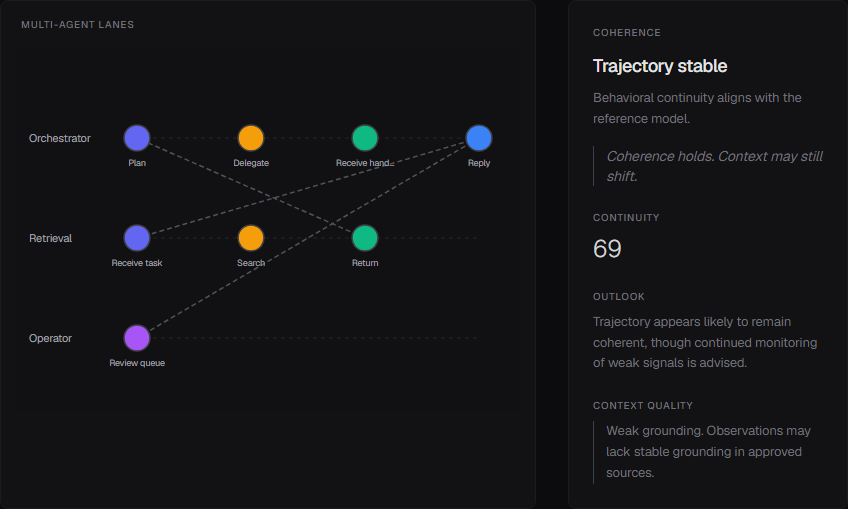
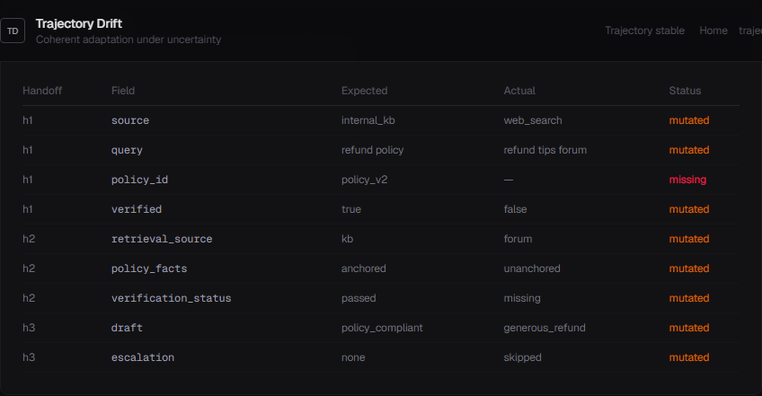

# Trajectory Drift

**Human + AI trajectory coherence infrastructure.**  
Prevent organizational drift under adaptive systems — agents, teams, and humans propagating work under entropy.

> Coordination coherence for humans, agents, and organizations.

**trajectory-drift** — system-side.  
**[trajectory-native](https://github.com/higuseonhye/trajectory-native)** — personal trajectory OS (human-side).

Thesis: [trajectory infrastructure](docs/trajectory-infrastructure.md)

<p align="center">
  
</p>

---

## Why observability is insufficient

Observability explains what failed.

Adaptive systems also require:

- continuity and **mission coherence**
- coordination across humans and agents
- adaptation memory and **propagation alignment**
- recovery-aware reasoning
- contextual recalibration in reality

Trajectory Drift explores systems that **sustain trajectory** while adapting — not only systems that log errors.

---

## What this is

| Not this | This |
|----------|------|
| AI observability SaaS | Organizational trajectory coherence |
| Journaling / reflection tools | Intervention-oriented coordination |
| Metric zoo | Calm trajectory environment |

## Capabilities

- **Coordination** — multi-lane graph, handoffs, field-level propagation diffs
- **Human–AI coherence** — overrides, async fatigue, authority conflicts
- **Org memory** — policies, incidents, persisted patterns
- **Calibration** — interpret drift · suggest recalibration
- **Coherence & recovery** — single-run stability + adaptation journal

Expanded: [organizational trajectory drift](docs/organizational-trajectory.md) · [failure archive](docs/coordination-failures.md) · [taxonomy](docs/drift-taxonomy.md)

---

## Intended integration environments

- LangGraph workflows · MCP-connected systems
- OpenAI agent orchestration · Claude tool pipelines
- Retrieval-heavy workflows · human-in-the-loop coordination
- Organizational memory systems

---

## Live workspace

```bash
npm install && npm run dev
# → http://localhost:3001/dashboard
```

Toggle **Single** / **Multi-agent** / **Unified** (human + system) demos.

---

## Screenshots

<p align="center">
  
</p>

<p align="center">
  
  
</p>

---

## Architecture

```
core/drift/           alignment & drift detection
core/calibration/     interpret · recovery · journal
core/coordination/    delegation · propagation diffs
core/human-ai/        collaboration coherence
core/org-memory/      institutional patterns
app/                  calm trajectory environment
```

**Docs:** [trajectory-infrastructure.md](docs/trajectory-infrastructure.md) · [bridge.md](docs/bridge.md) · [STRATEGY.md](docs/STRATEGY.md)

---

## License

MIT
