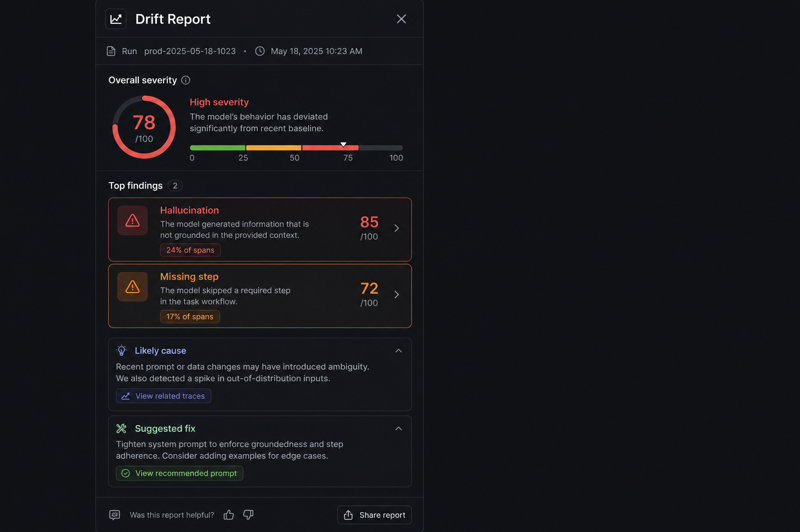
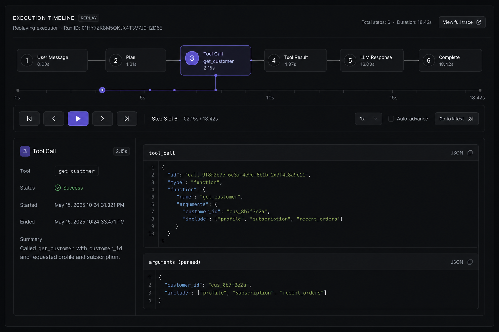

# Trajectory Drift

**AI agent observability for production runs.**  
Ingest execution logs, visualize agent trajectories, and detect drift — missing steps, hallucinations, and semantic deviation — with actionable reports.

<p align="center">
  
</p>

<p align="center">
  <a href="#quick-start">Quick start</a> ·
  <a href="#live-demo">Live demo</a> ·
  <a href="#how-it-works">How it works</a> ·
  <a href="docs/launch/x-posts.md">Launch posts</a>
</p>

---

## Why Trajectory Drift

AI agents fail quietly. A run can skip retrieval, invent observations, or diverge from an approved workflow — and traditional logs won't show you *where* or *why*.

Trajectory Drift compares live agent runs against a **golden trajectory** and surfaces:

| Signal | What it means |
|--------|----------------|
| **Missing step** | Expected tool or action never executed |
| **Hallucination** | Ungrounded tool output or fabricated observation |
| **Deviation** | Wrong step type or semantic drift from reference |

---

## Product screenshots

### Dashboard overview
Full observability surface: graph, drift score, timeline replay, and report sidebar.

<p align="center">
  
</p>

### Trajectory graph
Step-level graph with drift nodes highlighted in red.

<p align="center">
  
</p>

### Drift report
Each finding includes location, severity score, likely cause, and suggested fix.

<p align="center">
  
</p>

### Timeline replay
Scrub through agent execution step-by-step.

<p align="center">
  
</p>

---

## How it works

```
JSON logs  →  Ingestion  →  Trajectory graph  →  Drift engine  →  Report
```

1. **Ingest** — Upload or auto-load agent execution logs (`reference` + `actual` trajectories).
2. **Graph** — Build a directed graph of thoughts, tool calls, observations, and responses.
3. **Detect** — Run embedding similarity + rule-based checks for drift.
4. **Report** — Generate severity-scored findings with remediation guidance.

---

## Live demo

Open the dashboard — a sample support-agent scenario loads automatically. No upload required.

```bash
npm install
npm run dev
# → http://localhost:3001/dashboard
```

Landing page: `http://localhost:3001`

---

## Quick start

```bash
git clone <repo-url>
cd trajectory-drift
npm install
npm run dev
```

### Log format

```json
{
  "reference": {
    "id": "golden-run",
    "steps": [
      { "id": "s1", "kind": "thought", "label": "Plan", "content": "..." },
      { "id": "s2", "kind": "tool_call", "label": "Retrieve", "content": "retrieve_knowledge(...)" }
    ]
  },
  "actual": {
    "id": "live-run",
    "steps": [ "..."]
  }
}
```

Sample data: [`public/demo-agent-run.json`](public/demo-agent-run.json)

---

## Repository structure

```
trajectory-drift/
├── app/                 # Next.js UI (landing + dashboard)
├── core/                # Drift engine, graph builder, reports
├── ingestion/           # Log parsing & pipeline
├── eval/                # Evaluation harness (WIP)
├── assets/screenshots/  # Product & README visuals
├── docs/                # Architecture & launch materials
└── public/              # Static demo data
```

---

## Tech stack

- **Next.js 16** · App Router · TypeScript
- **D3** · Trajectory graph visualization
- **Tailwind CSS v4** · Dark-first UI

---

## Scripts

| Command | Description |
|---------|-------------|
| `npm run dev` | Dev server (port 3001) |
| `npm run build` | Production build |
| `npm run typecheck` | TypeScript check |
| `npm run lint` | ESLint |

---

## Roadmap

- [ ] Production embedding providers (OpenAI, Cohere)
- [ ] Webhook / API ingestion
- [ ] CI integration for golden trajectory regression
- [ ] Team dashboards & alert routing

---

## License

MIT — see [LICENSE](LICENSE).
