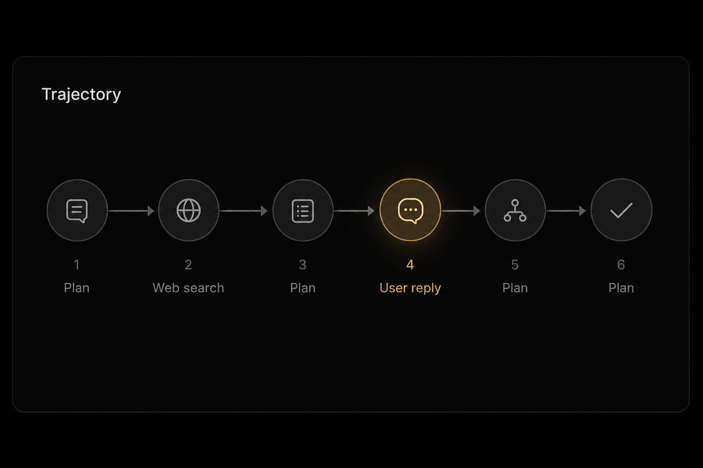
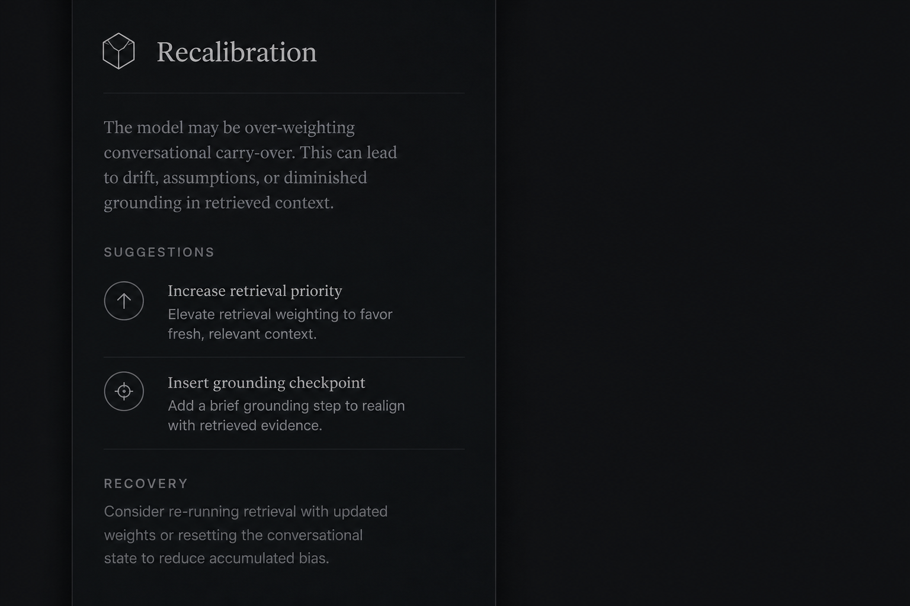
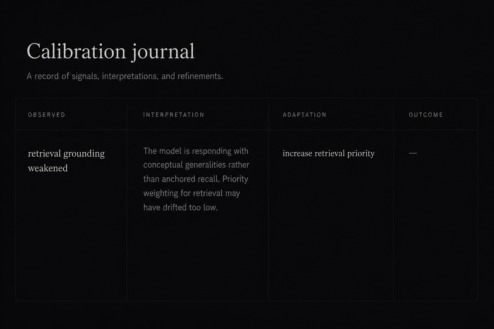

# Trajectory Drift

**Adaptive trajectory calibration for AI systems.**

Detecting drift is only the first step. The real goal is **maintaining coherent behavior under changing contexts** — in noisy, low-signal environments where adaptation matters more than alerts.

<p align="center">
  
</p>

---

## What this is

A **calm calibration environment** — not a monitoring dashboard.

| Not this | This |
|----------|------|
| Alert overload | Reflective observation |
| Performance scores | Coherence signals |
| Error logging | Adaptation memory |
| Panic aesthetics | Composed interaction |

## Capabilities

- **Coherence indicators** — trajectory stable · coherence weakening · grounding unstable
- **Context quality** — stale attachment, weak grounding, excessive carry-over
- **Calibration layer** — interpret drift · suggest behavioral recalibration
- **Recovery** — what stabilized · what was learned
- **Calibration journal** — observed → interpreted → adapted → outcome
- **Forecast** — whether continuity is likely to degrade

## Live workspace

```bash
npm install && npm run dev
# → http://localhost:3001/dashboard
```

Demo loads automatically. No setup theater.

---

## Screenshots

<p align="center">
  
</p>

<p align="center">
  
  
</p>

<p align="center">
  
</p>

---

## Architecture

```
core/drift/          detection
core/calibration/    interpret · context · recovery · journal
app/                 calm workspace UI
```

---

## License

MIT
