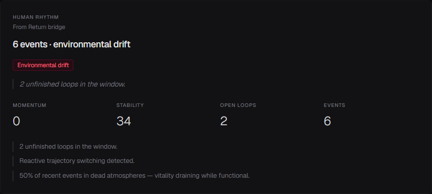

# Drift

*Part of [Drift & Return](https://github.com/higuseonhye/return/blob/main/docs/human-rhythm.md)*

---

Teams don't collapse either. They **fade** — executing, shipping, measuring — while warmth, meaning, and continuity quietly leave the room.

**Drift** notices when rhythm leaves collective systems: human teams, agent workflows, organizations that look operational but feel dead inside.

Not observability. Not productivity recovery. Not another dashboard shouting alerts.

A **quiet room** for:

- when rhythm fades in coordination
- human trajectory from the Return bridge
- environmental drift — sterile atmospheres, numbness, awe lost
- memory of what the system chose to forget
- gentle recovery — not panic, not optimization theater

> *Are we still here — or just functioning?*

<p align="center">
  
</p>

---

## The feeling

Same world as Return: vermouth hour patience, kissaten silence, greenhouse warmth. Interfaces that breathe. Copy that doesn't hustle.

[Shared aesthetic →](https://github.com/higuseonhye/return/blob/main/docs/aesthetic-system.md)

---

## Open the room

```bash
npm install && npm run dev
# → http://localhost:3001/dashboard
```

Single · multi-agent · unified demos — human rhythm alongside system rhythm.

---

## Ecosystem

| Name | Repository | Role |
|------|------------|------|
| **Return** | [return](https://github.com/higuseonhye/return) | Personal rhythm |
| **Drift** | [drift](https://github.com/higuseonhye/drift) | Collective rhythm — teams, agents, orgs |
| **Continuity** | [continuity](https://github.com/higuseonhye/continuity) | Decision memory |

Philosophy: [human rhythm (Return)](https://github.com/higuseonhye/return/blob/main/docs/human-rhythm.md) · [about](docs/ABOUT.md) · [environment & state](docs/environment-design.md) · [framework/](framework/)

---

## For builders

Coordination graphs, propagation, calibration journal — technical depth under a warm surface. See [STRATEGY.md](docs/STRATEGY.md) and [framework/drift-taxonomy/](framework/drift-taxonomy/) for precision layers.

---

## Status

Evolving in public. **Drift** · [github.com/higuseonhye/drift](https://github.com/higuseonhye/drift)

MIT
